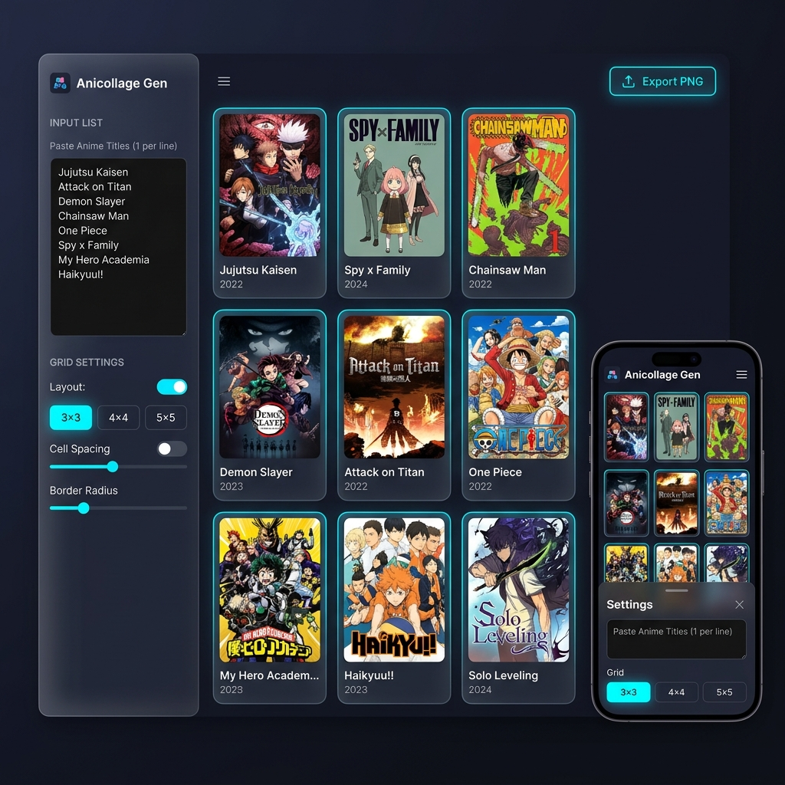

# Otaku Grid 🎨

**Build beautiful anime collages in seconds!** 

A fast, interactive web app that lets you create stunning anime cover collages with drag-and-drop functionality, multiple export formats, and real-time editing.

  

<p align="center">
  
</p>

---

## ✨ Features

- 🎯 **Quick Setup** - Just paste anime titles and generate instantly
- 🔄 **Dual API Support** - AniList & Jikan with automatic fallback
- 📐 **Flexible Grid Sizes** - 3×3, 4×4, 5×5, or auto-fit layouts
- 🖼️ **Multiple Export Formats**
  - PNG (High quality)
  - JPEG (Optimized size)
  - Instagram 1080×1080 (Ready to post)
- ✏️ **Edit Mode** - Replace or remove tiles after generation
- 🎨 **Title Overlays** - Toggle anime titles on covers
- 📋 **Preset Collections** - Top Shonen, Romance, Starter Pack
- 🔗 **Shareable Links** - Export and share your collages
- 💾 **Smart Caching** - Faster repeated searches via localStorage
- 🌐 **Responsive Design** - Works on desktop, tablet, and mobile
- ♿ **Accessible** - Full keyboard navigation & screen reader support
- 🚀 **Fast Performance** - No build tools, pure vanilla JavaScript

---

## 🚀 Getting Started

### Local Setup

1. **Clone the repository**
   ```bash
   git clone https://github.com/Parthivkoli/Otaku-Grid.git
   cd Otaku-Grid
   ```

2. **Open in browser**
   ```bash
   # Simply open index.html in your browser
   # Or use a local server (recommended for better performance)
   python3 -m http.server 8000
   # Then visit http://localhost:8000
   ```

That's it! No installation or build process required.

---

## 📖 Usage Guide

### Creating a Collage

1. **Enter Titles**
   - Paste anime/manga titles (one per line) in the input area
   - Or click a preset: 🔥 **Top Shonen**, 💕 **Romance**, 🌟 **Starter Pack**

2. **Configure Settings**
   - **Source**: Choose between AniList or Jikan
   - **Grid Size**: Select 3×3, 4×4, 5×5, or Auto
   - **Display**: Toggle title overlays on/off

3. **Generate**
   - Click "Generate Collage" and wait for covers to load
   - The system will automatically fetch the best available cover for each title

4. **Edit (Optional)**
   - Click "Edit Grid" to enter edit mode
   - Click any tile to replace or remove it
   - Click "Edit Grid" again to exit

### Exporting

1. Select export format (PNG/JPEG/Instagram)
2. Click "Export"
3. Your collage will download as an image file

**Export Formats:**
- **PNG**: Lossless quality, larger file size
- **JPEG**: Compressed, optimized for sharing
- **Instagram 1080**: Pre-sized for Instagram feed with branding

### Sharing

1. Click "Copy Link" to get a shareable URL
2. Your collage configuration is encoded in the URL
3. Share the link with friends to let them view your setup

---

## 🛠️ Technical Details

### Architecture

- **Frontend**: Vanilla JavaScript (no frameworks)
- **Styling**: Modern CSS with CSS Grid & Flexbox
- **APIs**: 
  - [AniList GraphQL API](https://anilist.co/api/v2/docs)
  - [Jikan API](https://jikan.moe/docs/api/v4)
- **Storage**: localStorage for caching cover URLs
- **Export**: Canvas 2D API with custom proxying for CORS robustness

### How It Works

1. **Title Fetching**
   - Normalizes input (lowercase, trim whitespace)
   - Fetches from primary API (AniList by default)
   - Falls back to secondary API if not found
   - Returns best available cover image

2. **Image Loading (Export)**
   - Attempts direct fetch
   - Falls back to weserv.nl proxy
   - Falls back to corsproxy.io if needed
   - Ensures covers always appear in exports

3. **Caching**
   - Stores successful searches in localStorage
   - Speeds up repeated searches
   - Can be cleared in Settings

---

## 📦 File Structure

```
Otaku-Grid/
├── index.html          # Main HTML file with structure & modals
├── style.css           # Complete styling (responsive design)
├── app.js              # All logic (800+ lines of code)
└── README.md           # This file
```

---

## 🎨 Customization

### Changing Colors

Edit the CSS variables at the top of `style.css`:

```css
:root {
  --bg: #0b0d13;           /* Background color */
  --surface: #151822;      /* Surface/card color */
  --accent: #02a9ff;       /* Primary accent */
  --text: #e8eaf0;         /* Text color */
  --muted: #6c7a92;        /* Muted text */
  --error: #ff4757;        /* Error color */
}
```

### Adding Presets

Edit the `PRESETS` object in `app.js`:

```javascript
const PRESETS = {
  shonen: ["Naruto", "One Piece", ...],
  custom: ["Your", "Custom", "Titles"]
};
```

---

## 🐛 Troubleshooting

| Issue | Solution |
|-------|----------|
| Covers Not Showing | Check console (F12), try different source, clear cache |
| Export Not Working | Verify all covers loaded, try different format |
| Slow Performance | Clear cache, reduce grid size, use JPEG export |
| Title Not Found | Try alternative spelling, check if anime exists |

---

## 🤝 Contributing

Found a bug or have an idea? 

1. Fork the repository
2. Create a feature branch (`git checkout -b feature/amazing`)
3. Commit changes (`git commit -m 'Add feature'`)
4. Push (`git push origin feature/amazing`)
5. Open a Pull Request

---

## 📄 License

MIT License - feel free to use this project however you'd like!

---

## 🌟 Credits

- **APIs**: [AniList](https://anilist.co) & [Jikan](https://jikan.moe)
- **Image Proxies**: [weserv.nl](https://weserv.nl) & [corsproxy.io](https://corsproxy.io)
- **Fonts**: [Google Fonts](https://fonts.google.com)

---

**⭐ If you find this project useful, please leave a star! It helps others discover it.**