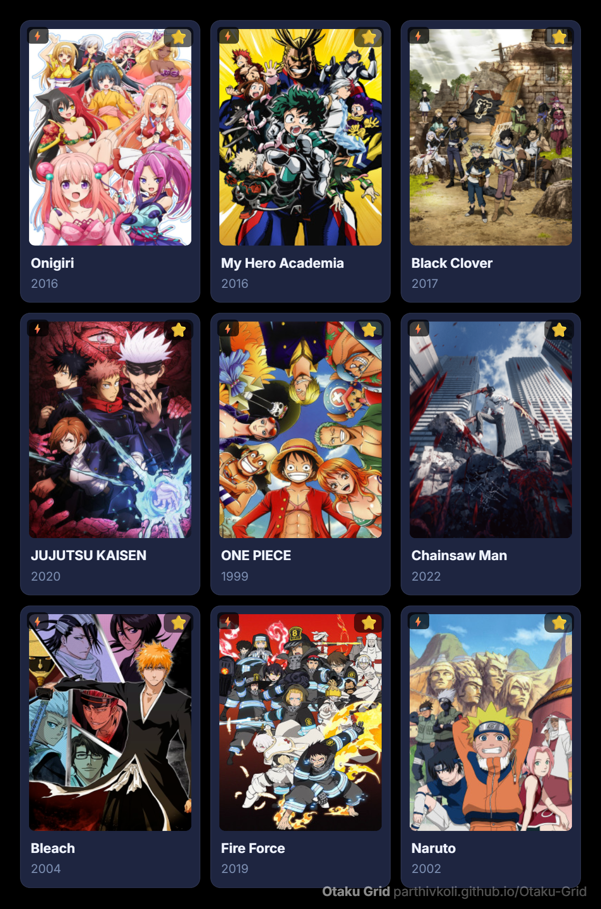
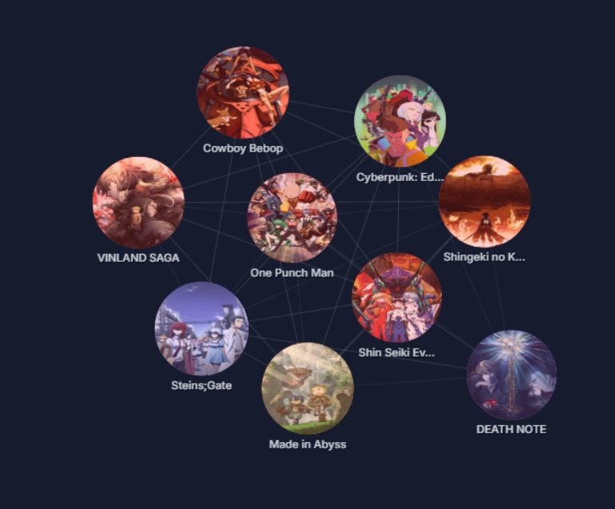
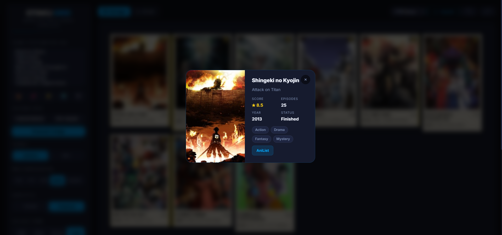
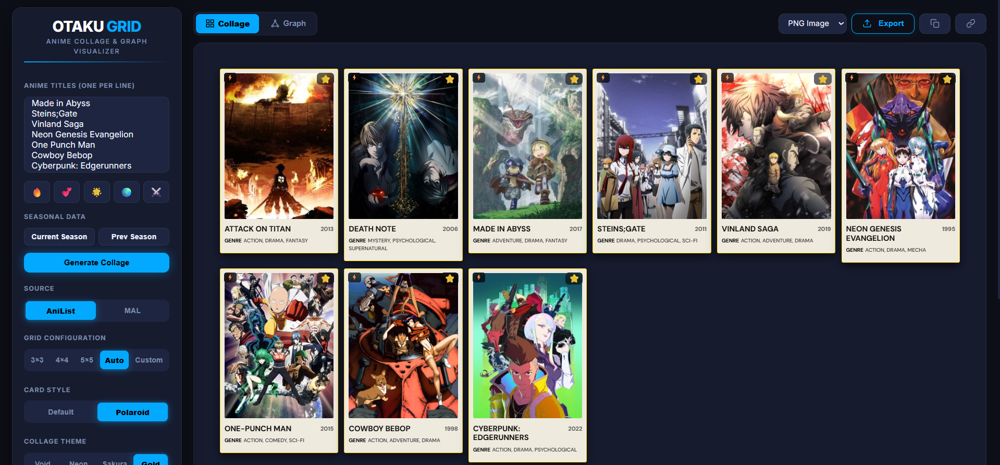

# 🌌 Otaku Grid

  

  <strong>The Ultimate Anime Collage & Social Graph Visualizer.</strong> 
  Generate stunning anime grids, explore genre relationships, and share your taste with the world.

  
  
  

---

## ✨ Features

- **🚀 Batched Fetching**: Ultra-fast anime data retrieval using optimized AniList GraphQL queries.
- **🖼️ Stunning Collages**: Create 3x3, 4x4, 5x5, or custom grids with multiple themes (Void, Neon, Sakura, Gold).
- **🕸️ Bubble Graph View**: Interactive force-directed graph to visualize shared genres and relationships between your favorite series.
- **✨ Full Autocomplete**: Powered by AniList search for effortless list creation.
- **📁 Save & Load Layouts**: Export your perfectly crafted grids as JSON and reload them anytime.
- **⭐ Watchlist Integration**: Star your shows and track what you've watched directly on the grid.
- **Detailed Modals**: Dig deep into anime stats, scores, and status with a single click.
- **Export Ready**: One-click PNG/JPEG export or copy to clipboard for quick sharing.

---

## 📸 Exhibition

### 🖼️ Master Collage View
Experience the full glassmorphic aesthetic with high-resolution anime covers and dynamic reflections.

  

### 🔍 Features & Interaction
<table align="center">
  <tr>
    <td width="50%" align="center">
      <strong>🕸️ Bubble Graph View</strong> 
      
    </td>
    <td width="50%" align="center">
      <strong>📋 Detail Inspector</strong> 
      
    </td>
  </tr>
  <tr>
    <td width="50%" align="center">
      <strong>📸 Polaroid Mode</strong> 
      
    </td>
    <td width="50%" align="center">
      <strong>⚡ Loading States</strong> 
      
    </td>
  </tr>
</table>

---

## 🛠️ Built With

- **HTML5 / CSS3**: Vanilla power with custom design system.
- **Vanilla JavaScript**: Pure logic, zero heavy dependencies.
- **AniList API**: High-performance GraphQL data source.
- **Jikan API**: Reliable MAL metadata fallback.
- **Canvas API**: High-performance rendering for the social graph.

---

## 🚀 Getting Started

1. **Visit**: [Otaku Grid Live](https://parthivkoli.github.io/Otaku-Grid/)
2. **Type**: List your favorite anime titles in the sidebar.
3. **Generate**: Hit "Generate Collage" and watch the magic happen.
4. **Export**: Save your masterpiece and share it!

---

## 🗺️ Roadmap

- [x] Batched API Fetching
- [x] Force-Directed Bubble Graph
- [x] Multi-Theme Support
- [ ] List Import (MAL/AniList Usernames)
- [ ] Collaborative Live Grids
- [ ] Mobile PWA Support

---

  Made with ❤️ for the Anime Community.

